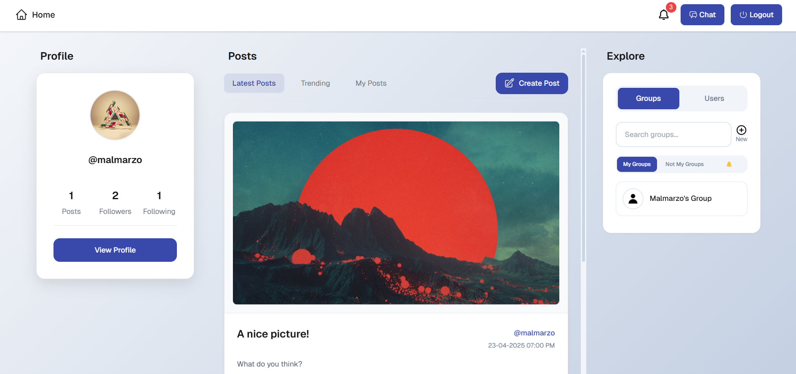

# social-network

A full-stack Facebook-like social media application made using Next.js and Go.



### Prerequisites

- Install Node if not installed
- Install pnpm:
  `npm install -g pnpm`
- Clone the repo: `https://github.com/malmarzo/social-network.git`

### Running the frontend

- Navigate to the frontend dir: `cd frontend`
- Install packages: `npm install`
- Run: `pnpm dev` or `npm run dev`
- Application will start on port `3000`

### Running the backend

- Navigate to the backend dir: `cd backend`
- Run: `go run cmd/server.go`

### Running on Docker
- In the root directory `/social-network`
- Run the command `docker compose up`
- Containers will start on port 3000 (frontend) and 8080 (backend)


### Features
- Secure signup and login with session-based authentication
- Create and view posts
- Like, dislike, and comment on posts
- Add images to posts and comments
- Public and private profiles
- Follow and unfollow users
- Real-time private chat and notifications
- Create and join group chats
- Create group posts and events


### Project Structure

```
social-network/
│── frontend/
│   ├── app/
│   ├── public/
│   ├── styles/
│   ├── utils/
│
└── backend/
    ├── cmd/
    │   └── server.go
    │
    ├── pkg/
        ├── api/
        ├── dataModels/
        ├── db/
        │   ├── migrations/
        │   ├── queries/
        │   └── sqlite/
        ├── middleware/
        ├── utils/
        └── websocket/
```

